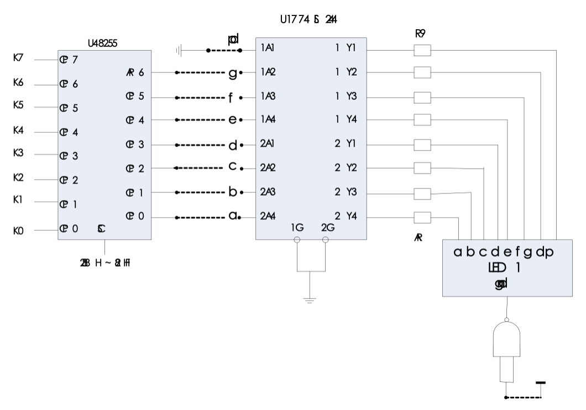
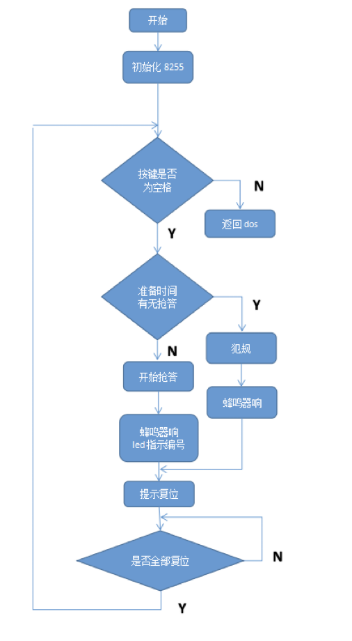

# Microcomputer Principle and Interface Technology Experiment Report [Competition Buzzer]

**Name**: Peng Haibi

## I. Experimental Objectives

The competition buzzer is a comprehensive self-designed experiment that covers parallel interface chips, interrupt controllers, timer counters, DOS function calls, etc. in this course. Through this experiment, one can understand the coordinated use of various interface circuits in the microcomputer system, master the principle of software and hardware collaboration, and be familiar with the comprehensive application of microcomputer principles and interface technology. The specific experimental objectives are as follows:

1. Familiarize with the basic working principle of the competition buzzer.
2. Understand the display working principle of the digital tube and the encoding methods of common cathode and common anode digital tubes, especially the driving problem of the LEDs in the digital tube.
3. Master the comprehensive application of parallel interface 8255, interrupt controller, timer counter, and DOS function calls.

## II. Experimental Equipment and Environment

1. 1 TPC-JK-II experimental system
2. 1 set of software with the TPC-JK-II experimental system - TPC-JK-II integrated development environment
3. 1 PC microcomputer

## III. Experimental Content and Indicators

### 3.1 Design Requirements

This experiment requires using the knowledge learned in class to independently design a "competition buzzer" and implement its basic functions on the microcomputer principle and interface technology experimental platform.
Use logic switches K0 - K7 to represent competition buzzer buttons 0 - 7. When a certain logic level switch is set to high level "1", it is equivalent to a certain group of buzzer buttons being pressed. The program determines the first pressed group through judgment and displays its group number (0 - 7) on the seven-segment digital tube, and makes the speaker beep once. Press the space bar to start the next round of answering, and press other keys to exit the program.
Experimental Hints:
Set 8255 as port C input and port A output. Read the data of port C. If it is 0, it means no one has answered. If it is not 0, someone has answered. The group number can be judged according to the read data. Press the space bar on the keyboard to start the next round of answering, and press other keys to exit the program.
DOS function call for ringing:
MOV DL, 7 ; The ASCII code for ringing is 07
MOV AH, 2
INT 21H
Dynamic address allocation of 8255: Control register: 28BH
Port A address: 288H
Port C address: 28AH

### 3.2 Design Goals and Performance Indicators

1. Meet the basic design requirements.
2. Additional requirements (optional):
   - Be able to judge foul operations, that is, pressing the button before the answering starts.
   - Be able to sort according to the pressing time of the buttons and give the time interval between each button press as a basis for conflict arbitration.

### 3.3 Hardware Circuit Diagram

## IV. Program Flowchart

## V. Scheme Design and Discussion

### Scheme Comparison

#### Keyboard Input Module

**Scheme One**:
Use DOS function 1 to judge whether there is a keyboard input.
MOV AH, 01H ; Input a character
INT 21H
CMP AL, 20H ; When it is a space, start preparation
**Scheme Two**:
Use DOS function 6 to judge whether there is a keyboard input.
MOV DL, input flag
MOV AH, 06H
INT 21H
Both schemes can determine whether there is a keyboard input. Scheme one is simpler and more basic, and it is easier to judge the keyboard input symbol and adjust the overall program design idea. Therefore, we choose scheme one.

#### 8255 Initialization Module

**Scheme One**:
MOV DX, 28BH
MOV AL, 89H
OUT DX, AL ; Port A output in mode 0, port B output in mode 0, port C input
**Scheme Two**:
MOV DX, 28BH
MOV AL, 92H
OUT DX, AL ; Port A input in mode 0, port B output in mode 0, port C output
Both methods can realize the connection between the 8255 chip and the buzzer answering module and the digital tube display module. The difference is that in scheme one, the hardware circuit needs to connect port A to the digital tube module and port C to the buzzer answering module; while in scheme two, the hardware circuit needs to connect port C to the digital tube module and port A to the buzzer answering module. We choose scheme one in the experiment.

#### Buzzer Control

**Scheme One**:
Through hardware connection and program control, use the output function of port B of the 8255 chip to control the enable end of the buzzer, and control the duration of the buzzer ringing through programming. In the hardware connection, one port B of the 8255 needs to be connected to the enable end of the buzzer. The specific program is as follows:
M2: MOV CX, 02FFH
LOP: MOV AL, 01H
MOV DX, 289H ; Port B outputs 1, PB0 outputs high level to the buzzer
OUT DX, AL
LOOP LOP
MOV AL, 00H
OUT DX, AL ; Turn off the buzzer
**Scheme Two**:
Call the DOS function 7 for ringing.
MOV DL, 7
MOV AH, 2
INT 21H ; Function call for ringing
In the experiment, we realized the control of the buzzer through hardware connection and program control, but the implementation effect of the DOS function 7 is not ideal. Therefore, we adopt scheme one.

#### Buzzer Button Reception Module

Use port C of 8250 as input, work in mode 0, read the button input state through programming, extract its number, and then look up the table to send the corresponding code of the digital tube to port A for output.
The specific program is as follows:
L0: MOV DX, 28AH
IN AL, DX ; Read the state of port C
CMP AL, 0 ; If it is 0, loop
JZ L0
MOV BL, 0 ; BL stores the group number
L1: INC BL
SHR AL, 1 ; Logically shift AL to the right
JNC L1
DEC BL
MOV AL, BL ; Calculate the group number and temporarily store it in AL
MOV BX, OFFSET LIST ; Send the starting address of the seven-segment display code table to BX
AND AX, 00FFH ; Mask the high byte of AX, the group number
ADD BX, AX ; Form the address of the display character
MOV AL, [BX] ; Take out the character and send it to AL
MOV DX, 0288H
OUT DX, AL ; Send it to port A for output display

#### Foul Prompt Module

**Scheme One**:
Output on the screen through DOS function 9 to prompt for a foul.
The program is as follows:
MOV DX, OFFSET FANGUI ; Foul
MOV AH, 09H
INT 21H
**Scheme Two**:
Prompt for a foul by making the buzzer sound and display the number of the offender on the digital tube.
Just jump to the digital tube display module and the buzzer control module after a foul.
JMP M2 ; The buzzer sounds and resets
JMP L0 ; The digital tube displays, the buzzer sounds and resets

The complete program is as follows:
DATA SEGMENT
LIST DB 060H, 0DAH, 0F2H, 66H, 0B6H, 0BEH, 0E0H, 0FEH ; Common cathode digital tube segment code table 0 - 7
FUWEI DB 'Please reset the key ', 0AH, 0DH, '$'
ZHUNBEI DB 'Ready', 0AH, 0DH, '$'
KAISHI DB 'Go', 0AH, 0DH, '$'
FANGUI DB 'Fan Gui!', 0AH, 0DH, '$'
DATA ENDS

STACK1 SEGMENT STACK
DW 100H DUP(0)
STACK1 ENDS

CODE SEGMENT
ASSUME CS:CODE, DS:DATA, SS:STACK1
START: MOV AX, DATA
MOV DS, AX

MOV DX, 28BH
MOV AL, 89H
OUT DX, AL ; Initialize 8255, port A output in mode 0, port B output in mode 0, port C input

A0: MOV AH, 01H ; Input a character
INT 21H
CMP AL, 20H ; When it is a space, start preparation
JNZ A0 ; If it is not a space, loop
JMP M4

L0: MOV DX, 28AH
IN AL, DX ; Read the state of port C
CMP AL, 0 ; If it is 0, loop
JZ L0
MOV BL, 0 ; BL stores the group number
L1: INC BL
SHR AL, 1 ; Logically shift AL to the right
JNC L1
DEC BL
MOV AL, BL ; Calculate the group number and temporarily store it in AL
MOV BX, OFFSET LIST ; Send the starting address of the seven-segment display code table to BX
AND AX, 00FFH ; Mask the high byte of AX, the group number
ADD BX, AX ; Form the address of the display character
MOV AL, [BX] ; Take out the character and send it to AL
MOV DX, 0288H
OUT DX, AL ; Send it to port A for output display
; MOV DL, 7
; MOV AH, 2
; INT 21H ; Function call for ringing

M2: MOV CX, 02FFH
LOP: MOV AL, 01H
MOV DX, 289H ; Port B outputs 1, PB0 outputs high level to the buzzer
OUT DX, AL
LOOP LOP
MOV AL, 00H
OUT DX, AL ; Turn off the buzzer
MOV DX, OFFSET FUWEI ; Prompt for reset
MOV AH, 09H
INT 21H

LOP1: MOV DX, 28AH ; Read port C to ensure all are 0
IN AL, DX
CMP AL, 0
JNZ LOP1 ; Jump out of the loop when all buttons are reset
MOV AL, 0
MOV DX, 288H
OUT DX, AL ; Port A outputs 0, the digital tube does not display
MOV AH, 01H ; Input a character
INT 21H
CMP AL, 20H ; When it is a space, jump to M4, and exit when other keys are pressed
JZ M4
MOV AH, 4CH ; Return to DOS
INT 21H

M4: MOV DX, OFFSET ZHUNBEI ; Prepare, start after a delay
MOV AH, 09H
INT 21H

MOV BX, 0008H
M3: MOV CX, 02FFH
M1: MOV DX, 28AH ; Read port C to judge whether there is a foul
IN AL, DX
CMP AL, 0
; JNZ M2
JNZ FANGUI1 ; If it is not 0, it means answering before starting, a foul
LOOP M1
DEC BX
JNZ M3
MOV DX, OFFSET KAISHI ; Start
MOV AH, 09H
INT 21H
JMP L0

FANGUI1:
MOV DX, OFFSET FANGUI ; Foul
MOV AH, 09H
INT 21H
JMP M2 ; The buzzer sounds and resets

CODE ENDS
END START

## VI. Experimental Result Analysis

### 6.1 Experimental Effect

#### Buzzer Screen Output Interface

[Here should be the screen output interface diagram, but it is not clear in the text, so it cannot be accurately translated.]

After the program starts running, press the space bar, "Ready" will be displayed on the screen. If there is a foul within a certain period of time, "Fan gui" will be output on the screen, the buzzer will sound, and after stopping, the screen will prompt "Please reset the key". After all the buttons are reset, wait for the space bar. If there is no foul during this period, the screen will display "Go", and then the normal answering session can be entered. After one person answers, the buzzer will sound, the digital tube will display the number, and after the buzzer stops, the screen will prompt "Please reset the key". After all the buttons are reset, wait for the space bar. If other keys are pressed, the program will exit.

### 6.2 Result Analysis

The 8255A chip is a powerful parallel interface chip that can be applied to various occasions of parallel communication. Using its port input and output functions, external devices can be controlled and queried. The operation is simple and the application is convenient.
The competition buzzer has a high degree of comprehensiveness and tests comprehensive abilities. First, we need to control 8255 to make port C input and port A output. After obtaining the input data of port C, it needs to be processed to obtain the corresponding group number. Here, we use the circular shift right instruction. When a buzzer is pressed, the corresponding input is set to 1. After shifting n times, this bit is shifted to CF. By judging whether CF is 0, the group number can be obtained. Next, display the group number on the digital tube. Here, the segment codes for controlling the digital tube need to be defined in the data segment in advance. Taking the group number as the address offset, the corresponding segment code can be output through port A to complete the display. The remaining ringing and judging the button press can be completed by simple DOS function calls and hardware circuit connections.
This competition buzzer seems very difficult at first glance, but when you think about it carefully, it is composed of simple tasks. This also reminds us that when facing a difficult problem, we should break it down into smaller parts, not be intimidated, and complete it step by step. Eventually, the overall task can be solved. Similarly, in life, we should also start from small things and details, live each day well, and do every thing well to achieve success.

## VII. Experience and Insights

Before the experiment, our group conducted sufficient preview and discussion and compared various schemes. In terms of program design, I was mainly responsible for the design of the time delay between the preparation stage and the start of answering and the response time of the buzzer. When writing the report, I was mainly responsible for drawing the program flowchart.
This is the last experiment on microcomputer principles and interfaces this semester. The design of the competition buzzer is highly comprehensive and tests comprehensive abilities. It seems very difficult at first glance, but when you think about it carefully, it is composed of simple tasks. As long as we break it down into smaller parts, not be intimidated, and complete it step by step, we can finally solve the overall task. This experiment has helped us master more debugging methods for assembly language design, cultivated our interest in this discipline, and is conducive to our further study and research in this discipline in the future.
